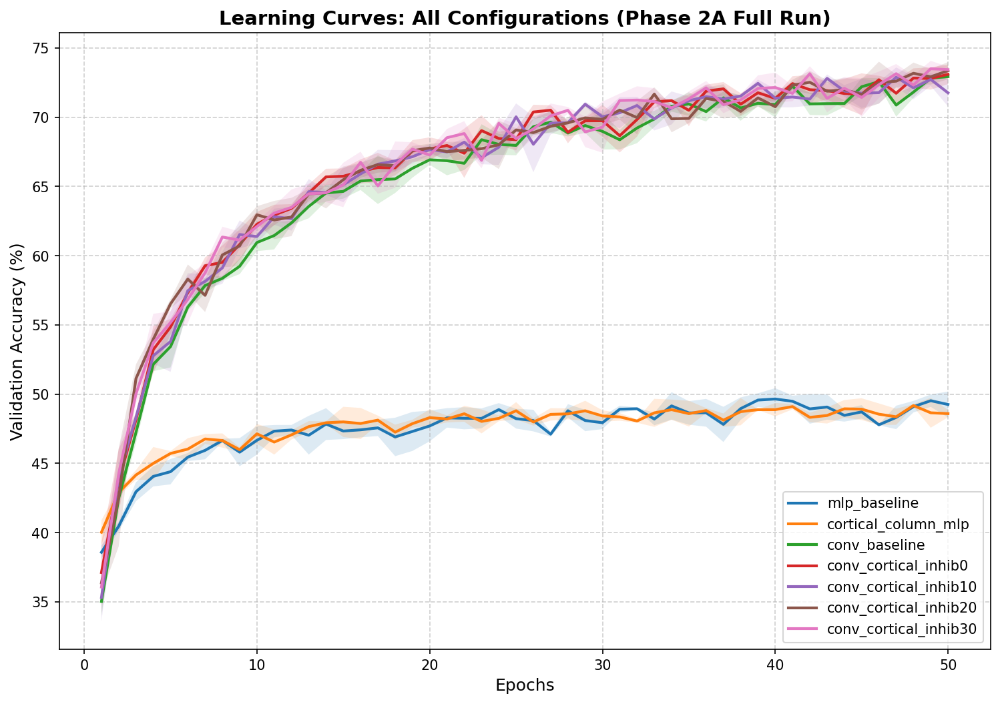
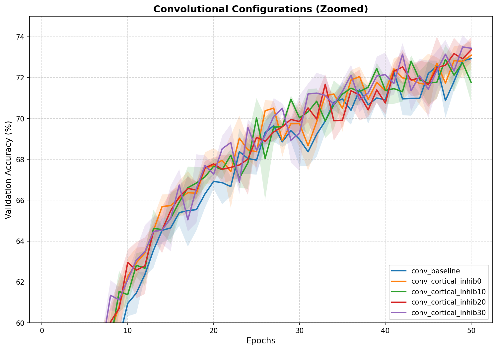
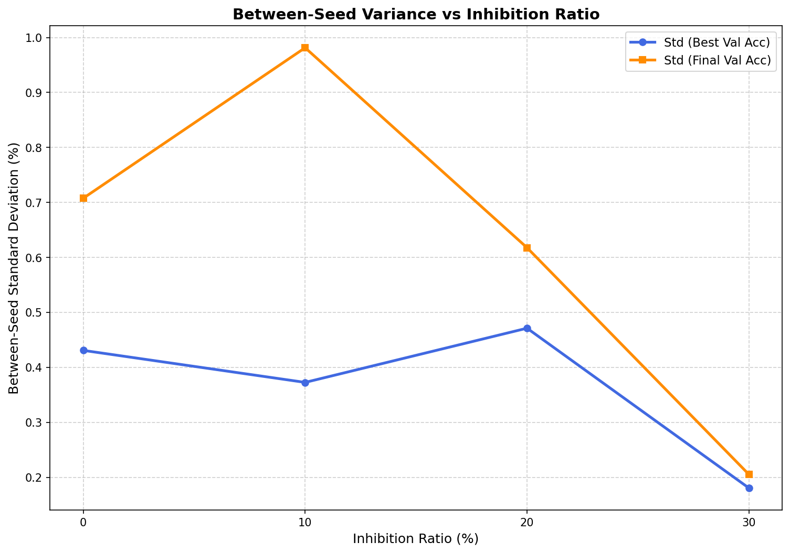
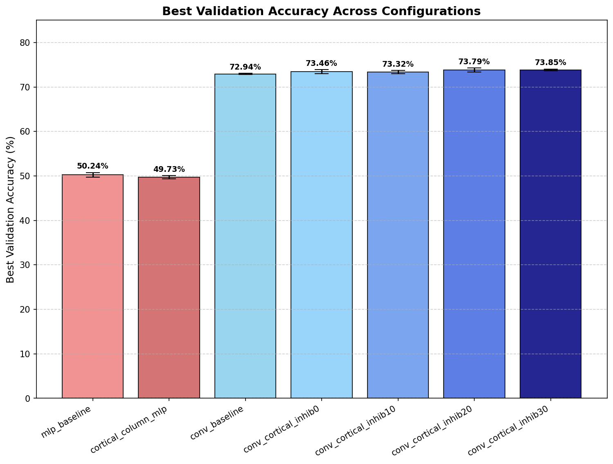

# BrainForge: Brain-Inspired Neural Architectures

> Cortex-inspired neural network components for PyTorch. 
> Research project exploring biological E/I balance, lateral connections, 
> and topographic organization in convolutional models.

**Author:** Darkhan T.  
**Status:** Phase 2A completed (May 2026)  
**License:** [TBD]

---

## Table of Contents

1. [Project Overview](#1-project-overview)
2. [Methodology Evolution: Phase 1 → Phase 2](#2-methodology-evolution-phase-1--phase-2)
3. [Diagnostic Findings](#3-diagnostic-findings)
4. [Main Results (Phase 2A)](#4-main-results-phase-2a)
5. [Discussion and Limitations](#5-discussion-and-limitations)
6. [Future Work](#6-future-work)
7. [Installation & Usage](#7-installation--usage)
8. [Repository Structure](#8-repository-structure)
9. [Citation](#9-citation)

---

## 1. Project Overview

BrainForge implements cortex-inspired components for convolutional neural networks:

- **6-layer cortical columns** (L1–L6) with distinct activation patterns
- **Inhibitory neurons** with parameterized E/I balance (0%–30%)
- **Lateral connections** (intra-layer recurrence)
- **TopoLoss** for topographic feature organization

The project tests whether biologically-grounded mechanisms from primate visual cortex (V1) translate into measurable benefits in modern CNN architectures.

---

## 2. Methodology Evolution: Phase 1 → Phase 2

### Phase 1 (Preliminary, April 2026)

- **Dataset:** CIFAR-10, 5,000 image subset
- **Epochs:** 5
- **Seeds:** 1
- **Augmentation:** none
- **TopoLoss weight:** default (uncalibrated, gradient ratio ~23× vs CE)
- **CorticalColumn (MLP-style) result:** 39.0% (single seed)

**Outcome:** Bio-components appeared to degrade performance. Investigation revealed:
- TopoLoss gradient dominated CE by ~23× at default weight
- Architecture (flat MLP) lacked spatial structure needed by bio-mechanisms
- Insufficient data and epochs for statistical validity

### Phase 2A (Rigorous, May 2026)

- **Dataset:** Full CIFAR-10 (50,000 train / 10,000 val)
- **Epochs:** 50
- **Seeds:** 3 (42, 123, 7)
- **Augmentation:** RandomCrop(32, padding=4) + RandomHorizontalFlip
- **TopoLoss weight:** 0.01 (calibrated to balance gradient norms)
- **Optimizer:** Adam, lr=1e-3, weight_decay=5e-4, batch=128

**Key methodological change:** Convolutional version (`ConvBackbone`) replaces flat MLP. All ConvCortical configurations enforce **strict total parameter symmetry** (2,123,022 total params) via Variant A frozen-weights protocol. Trainable parameter counts differ slightly between configurations due to inhibitory mechanism — this is documented in Section 4.2.

**Important note:** The 39.0% Phase 1 result is preserved as a methodological "before" reference, NOT as a comparison point in the main results table.

---

## 3. Diagnostic Findings

Three diagnostic experiments were conducted to ensure bio-components function correctly:

### 3.1 Gradient Norm Calibration

At default TopoLoss weight (λ=1.0), gradients from TopoLoss dominated CrossEntropy by ~23×. This explained Phase 1 performance issues. **TopoLoss weight calibrated to λ=0.01** for Phase 2A, balancing gradients to similar order of magnitude.

### 3.2 Untrained Activation Analysis

At initialization across inhibition ratios {0%, 10%, 20%, 30%}:
- **Dead neuron rate:** 0.0% on all layers (no representation collapse)
- **Inhibition effect:** Pre-norm suppression 100-900% absorbed by GroupNorm + ReLU
- **Excitatory/inhibitory gradient ratio:** Healthy gradients on both populations

### 3.3 Trained Representation Sharpening

After Short Prolog (10 epochs), L4 activation sparsity:
- **Untrained:** 50.34% zeros
- **Trained:** 69.28% zeros

Models develop sparse, selective representations as expected from biologically-inspired architectures.

---

## 4. Main Results (Phase 2A)

### 4.1 Configuration Summary

All 7 configurations trained on full CIFAR-10 for 50 epochs across 3 random seeds (42, 123, 7). All ConvBackbone variants use `max_inhibitory_ratio=0.3` to enforce strict total parameter symmetry.

| Configuration | Total Params | Trainable | Best Val Acc | Final Val Acc | Best Epoch | Train Time |
|---|---:|---:|:---:|:---:|:---:|:---:|
| mlp_baseline | 2,025,215 | 2,025,215 | 50.24% ± 0.52% | 49.25% ± 0.94% | 43.0 | 21 min |
| cortical_column_mlp | 2,024,206 | 2,024,206 | 49.73% ± 0.36% | 48.59% ± 0.26% | 47.3 | 23 min |
| conv_baseline | 2,123,022 | 1,783,050 | 72.94% ± 0.10% | 72.93% ± 0.09% | 49.7 | 3.8 hr |
| conv_cortical_inhib0 | 2,123,022 | 1,979,658 | 73.46% ± 0.43% | 73.10% ± 0.71% | 48.7 | 4.0 hr |
| conv_cortical_inhib10 | 2,123,022 | 2,005,262 | 73.32% ± 0.37% | 71.76% ± 0.98% | 48.0 | 4.1 hr |
| conv_cortical_inhib20 | 2,123,022 | 2,031,886 | 73.79% ± 0.47% | 73.36% ± 0.62% | 48.0 | 4.2 hr |
| **conv_cortical_inhib30** | 2,123,022 | 2,057,486 | **73.85% ± 0.18%** | **73.44% ± 0.21%** | 48.7 | 6.0 hr |

### 4.2 Isolated Comparisons

**A. Convolution vs MLP** (effect of spatial structure):
- MLP baseline: 50.24% → Conv baseline: 72.94% → **+22.70%**
- Convolutional inductive bias is essential for image classification.

**B. Lateral connections + parameter increase** (conv_baseline → conv_cortical_inhib0):
- 72.94% → 73.46% → **+0.52% mean** (total params identical: 2,123,022)
- *Caveat:* trainable params differ (1,783,050 vs 1,979,658, +196K). The +0.52% gain is partially confounded with the increase in trainable parameters. A controlled experiment with matched trainable parameters is required to isolate the contribution of lateral connections specifically. This is noted as a limitation.

**C. Between-seed variance and inhibition ratio**:
- Std (best) at inhib0: 0.43% → at inhib30: 0.18% → **2.4× reduction**
- Std (final) at inhib0: 0.71% → at inhib30: 0.21% → **3.4× reduction**
- Higher inhibition is associated with reduced between-seed variance. We do not claim mechanism causation (see Section 5.1).

**D. Bio-mechanisms on MLP** (mlp_baseline → cortical_column_mlp):
- 50.24% → 49.73% → **-0.51%** (slight degradation)
- The MLP-style implementation of cortical components does not transfer the gains observed in convolutional models. Whether this indicates a fundamental spatial requirement of biological mechanisms, or an artifact of how the MLP-style cortical column was constructed, requires further investigation.

### 4.3 Learning Curves



*Figure 1: Validation accuracy curves across all 7 configurations. Shaded regions represent ± std across 3 seeds.*



*Figure 2: Convolutional configurations (zoomed view, 60-75% accuracy range).*

### 4.4 Variance Analysis



*Figure 3: Between-seed standard deviation of validation accuracy as a function of inhibition ratio.*

### 4.5 Accuracy Comparison



*Figure 4: Best validation accuracy across all configurations with std error bars.*

---

## 5. Discussion and Limitations

### 5.1 Inhibition and Between-Seed Variance

Higher inhibition ratios are associated with reduced between-seed variance in final accuracy (2.4× reduction in std of best accuracy from inhib0 to inhib30). While this pattern is consistent with inhibition functioning as a homeostatic regularizer — analogous to its role in cortical E/I balance — our experiments do not isolate the mechanism. Alternative explanations include:

- Increased effective regularization from a larger number of trainable parameters
- Interactions with the optimization landscape
- Implicit smoothing of activations through soft suppression

A controlled study with matched trainable parameter counts and ablation of specific inhibition mechanisms would be required to establish causation.

### 5.2 Augmentation Artifact in Early Training

All configurations (including conv_baseline without biological components) show validation accuracy exceeding training accuracy during the first ~10 epochs. This is an artifact of data augmentation (RandomCrop + HorizontalFlip applied only to training data), not a property of architectural choices. We report this transparency for methodological clarity; readers should not interpret early-epoch val > train dynamics as specific to inhibition mechanisms.

### 5.3 Convergence Trade-off and Ranking Sensitivity

Examination of best epoch values reveals an important limitation: conv_cortical_inhib20 reaches its best validation accuracy with one seed peaking at epoch 50 (the final epoch), indicating that model had not fully converged within our training budget. In contrast, inhib30 plateaued earlier. The current ranking between inhib20 (73.79%) and inhib30 (73.85%) differs by 0.06%, which is well within the std of either configuration. We treat the difference between inhib20 and inhib30 as **inconclusive** within our current methodology. Extended training (100+ epochs) could potentially reverse the ordering.

### 5.4 Spatial Structure Requirement

Cortical-inspired mechanisms provide measurable benefits only in convolutional architectures (+0.91% from conv_baseline to inhib30, with caveats noted in 4.2 and 5.1) and slightly hurt performance in flat MLPs (-0.51%). This suggests that lateral connections and inhibition rely on the preserved spatial structure of feature maps to function as intended.

### 5.5 Effect Size and Interpretation

The accuracy improvements are modest (0.5-0.9%) and partially confounded with parameter count differences. The variance improvements (2.4-3.4× std reduction) are larger but require mechanistic investigation. We interpret Phase 2A as **methodological validation** of the BrainForge framework — demonstrating that the architecture is correctly implemented, statistically rigorous, and produces measurable patterns — rather than a performance breakthrough. The framework is now sufficiently mature to test more sophisticated cortical mechanisms in Phase 2B and beyond.

---

## 6. Future Work

### 6.1 Controlled Parameter-Matched Comparison
Run conv_baseline with widened channels to match trainable parameter count of conv_cortical_inhib0, isolating the effect of lateral connections from parameter count.

### 6.2 Extended Training Schedule
Test whether 100-200 epoch training resolves the inhib20 vs inhib30 ranking question.

### 6.3 Inhibition Ratio Beyond 30%
The current sweep ends at 30%. Future work should determine the degradation point by testing 40%, 50%, and beyond.

### 6.4 Fine-Grained E/I Sweep
A 1-2% step sweep in the biological range (15%-25%) could identify whether the trend is monotonic or features local optima not visible in the coarse 10%-step sweep.

### 6.5 Phase 2B: NeuroSleep
Continual learning with neuromodulation and sleep consolidation builds on the validated ConvCortical architecture from Phase 2A.

### 6.6 Scale Beyond CIFAR-10
Validate findings on CIFAR-100, ImageNet-100, or domain-shifted datasets to assess generalizability.

### 6.7 Open-Source Licensing
Select and apply an open-source license (e.g., MIT License) prior to public release.

---

## 7. Installation & Usage

### Requirements
- Python 3.10+
- PyTorch 2.3+ (for CPU) or PyTorch 2.11+ with CUDA 12.8 (for GPU, RTX 50 series)
- NumPy < 2.0 (compatibility)
- See `pyproject.toml` for full list

### Installation
```bash
git clone https://github.com/Darkhan-fak/brainforge.git
cd brainforge
python -m venv .venv

# Windows activation:
.venv\Scripts\activate

# Linux/Mac activation:
source .venv/bin/activate

pip install -e .
```

### Running Phase 2A Benchmark
```bash
python benchmarks/run_full_benchmark.py
```

### Using BrainNet Components
```python
from brainnet import ConvBackbone

model = ConvBackbone(
    in_channels=3,
    hidden_channels=256,
    out_features=10,
    inhibitory_ratio=0.2,
    max_inhibitory_ratio=0.3,
    use_lateral=True,
)
```

---

## 8. Repository Structure

```
brainforge/
├── brainnet/
│   ├── conv_backbone.py
│   ├── cortical_column.py
│   ├── inhibitory.py
│   ├── lateral.py
│   ├── topo_loss.py
│   └── __init__.py
├── benchmarks/
│   ├── brainnet_cifar10.py
│   ├── baseline_mlp.py
│   ├── run_short_prolog.py
│   ├── run_full_benchmark.py
│   ├── inhibition_diagnostics.py
│   └── results/
│       ├── short_prolog/
│       └── full_run/
├── tests/
│   └── test_brainnet.py
├── pyproject.toml
├── README.md
└── implementation_plan.md
```

---

## 9. Citation

This is a research project in progress. Citation details will be added upon arxiv preprint submission.

For now:

```bibtex
@misc{brainforge2026,
  author = {Darkhan, T.},
  title = {BrainForge: Brain-Inspired Neural Architectures},
  year = {2026},
  publisher = {GitHub},
  howpublished = {\url{https://github.com/Darkhan-fak/brainforge}}
}
```

---

## Acknowledgments

- Open Brain Institute for cortical column reconstruction data
- TopoLoss original authors (Georgia Tech, 2025)

---

*Last updated: May 26, 2026 — Phase 2A completed.*
