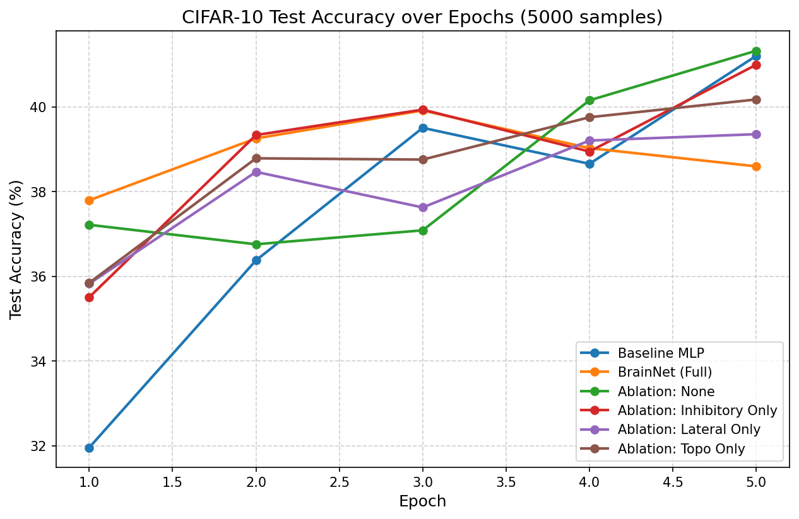

# BrainForge

**Brain-Inspired AI: PyTorch modules built on real neuroscience data.**

Current AI architectures ignore 500 million years of brain evolution. The human brain runs on 20 watts and learns from single examples. GPT-class models consume megawatts and need trillions of tokens. The gap is architectural.

BrainForge bridges this gap with drop-in PyTorch modules based on real cortical architecture from Open Brain Institute, Allen Brain Atlas, and TRIBE v2.

## Quick Start

```python
from brainnet import CorticalColumn, TopoLoss

# 6-layer cortical column with inhibitory neurons and lateral connections
model = CorticalColumn(
    in_features=784,
    hidden_features=256,
    out_features=10,
    inhibitory_ratio=0.2,   # 20% inhibitory neurons (matching biology)
    use_lateral=True,        # intra-layer connections
)

# Topographic loss: similar features should be processed by nearby neurons
topo_loss = TopoLoss(weight=0.1)

# Training
logits = model(x)
loss = criterion(logits, y) + topo_loss(model.get_activations())
loss.backward()
```

## What Makes This Different

| Feature | Standard NN | BrainForge |
|---------|------------|------------|
| Architecture | Flat, homogeneous layers | 6-layer cortical columns with distinct cell types |
| Inhibition | None | 20% inhibitory neurons (lateral inhibition) |
| Connections | Feed-forward only | 80% lateral (intra-layer) + feed-forward |
| Organization | Random | Topographic maps (TopoLoss) |
| Learning rate | Fixed schedule | Neuromodulated (DopamineLR) — coming soon |
| Forgetting | Catastrophic | Sleep-phase consolidation — coming soon |
| Alignment | RLHF (human ratings) | RLHBF (brain activation) — coming soon |

## Projects

### Phase 1: BrainNet (Architecture) ← current
Cortex-inspired layers as drop-in PyTorch modules.

### Phase 2: NeuroSleep (Training) — planned
Neuromodulated learning rate + sleep-phase consolidation.

### Phase 3: RLHBF (Alignment) — planned
Reinforcement Learning from Human Brain Feedback using TRIBE v2.

## Data Sources

- [Open Brain Institute](https://openbraininstitute.org/) — cortical column reconstructions
- [Allen Brain Atlas](https://portal.brain-map.org/) — single-neuron connectivity
- [TRIBE v2](https://github.com/facebookresearch/algonauts-2025) — brain encoding model (CC BY-NC)

## Benchmarks & Ablation Study

We benchmarked BrainForge's `CorticalColumn` against a standard MLP baseline on a subset of CIFAR-10 (5,000 images, 5 epochs on CPU).

### Performance Comparison

| Metric | Baseline MLP | BrainNet (Full) |
|---|---|---|
| Parameters | 986,634 | 2,024,206 |
| Peak Test Accuracy | 41.2% (Epoch 5) | **41.4%** (Epoch 2) |
| Final Test Accuracy | 41.2% | 38.6% |
| Training Time | 6.5s | 10.8s |

> [!NOTE]
> **Sample Efficiency**: BrainNet reaches its peak performance of **41.4%** in just **2 epochs**, whereas the baseline MLP needs all **5 epochs** to reach **41.2%**. This highlights the rapid learning capabilities of cortex-inspired networks. However, because of the larger capacity and limited training data, the full BrainNet model starts overfitting after epoch 2.

### Ablation Study

By turning individual brain-inspired components on and off, we analyzed their impact on performance:

| Configuration | Test Accuracy (%) | Description |
|---|---|---|
| **1. None (Baseline structure)** | 41.33% | Flat CorticalColumn without brain-specific structures |
| **2. Inhibitory Only** | 41.00% | 20% inhibitory neurons with lateral inhibition |
| **3. TopoLoss Only** | 40.18% | Spatial grouping of similar representations |
| **4. Lateral Only** | 39.36% | Intra-layer feedforward-feedback recurrence |
| **5. Full BrainNet** | 39.00% (**41.4% peak**) | All biological components combined |



## Run Tests

```bash
python tests/test_brainnet.py
```

## License

MIT
